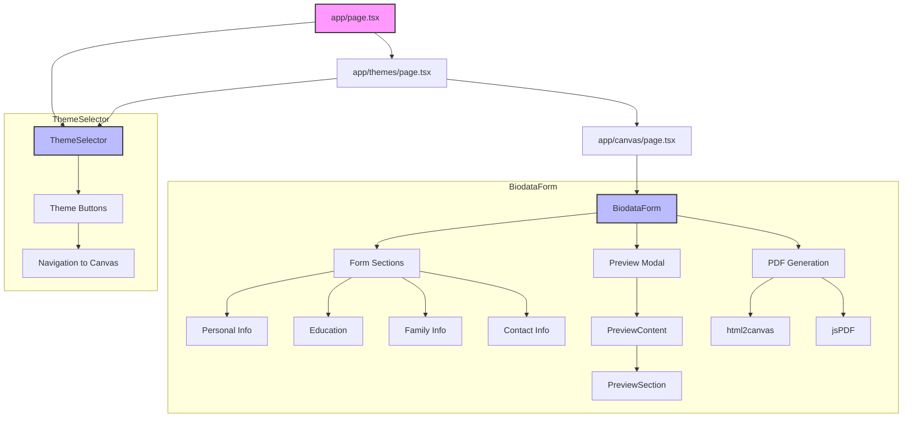
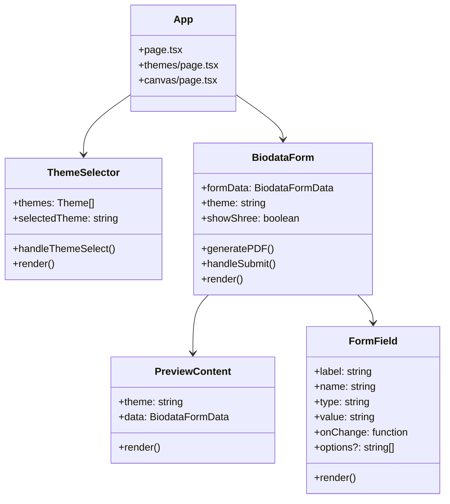
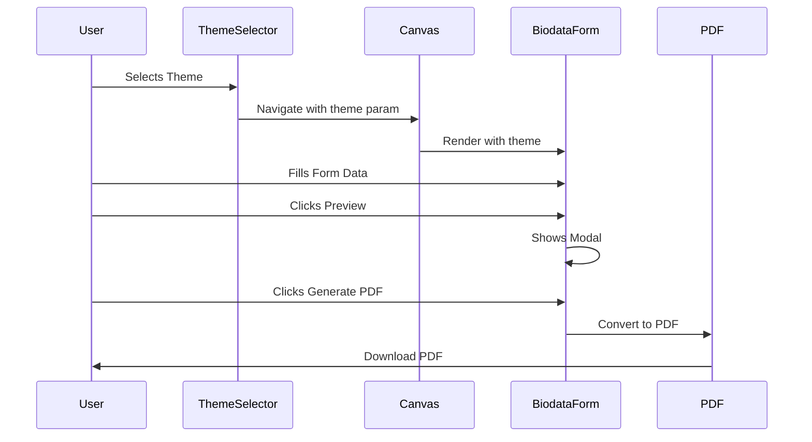

# Biodata Generator Documentation

## Project Overview
This application allows users to create professional biodatas with customizable themes, form fields, and PDF generation capabilities.

## Architecture Diagrams

### 1. Component Relationship


### 2. Component Structure


### 3. User Flow


## Key Features

### 1. Theme System
- Multiple predefined themes
- Custom background patterns
- Border variations
- Color schemes
- A4 page formatting

### 2. Form Components
- Personal Information
  - Name, Birth details
  - Religion, Caste
  - Horoscope details
- Education & Career
  - Education details
  - Occupation
  - Income
- Family Information
  - Parents details
  - Siblings
  - Family background
- Contact Details
  - Address
  - Phone numbers

### 3. Customization Options
- Show/Hide fields
- Optional sections
- Custom header text
- Multilingual support (Marathi/English)

### 4. Preview & Generation
- Live preview modal
- PDF generation
- A4 size formatting
- Print-optimized layout

## Technical Stack
- Next.js 13+ with App Router
- TypeScript
- Tailwind CSS
- html2canvas for PDF generation
- jsPDF for document creation

## File Structure
```
project/
├── app/
│   ├── page.tsx
│   ├── themes/
│   │   └── page.tsx
│   └── canvas/
│       └── page.tsx
├── components/
│   ├── ThemeSelector.tsx
│   ├── BiodataForm.tsx
│   ├── PreviewContent.tsx
│   └── FormField.tsx
└── public/
    └── themes/
        └── [theme-images]
```

## Usage Flow
1. User selects a theme from the theme gallery
2. System navigates to form with selected theme
3. User fills in biodata information
4. Preview available at any time
5. Generate PDF with final layout
6. Download or print the document